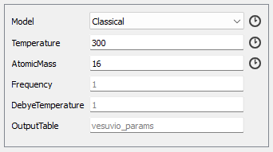
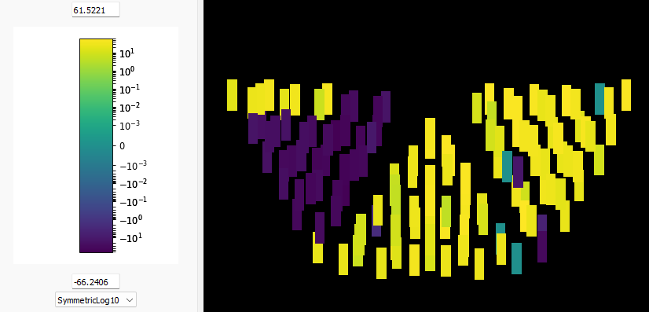
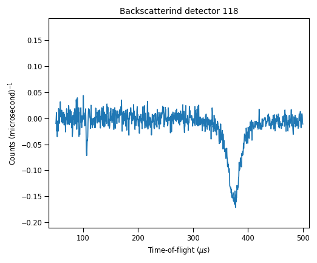

The following user guide is adapted from the Vesuvio Compton Scattering Analysis Script, written by Damien CÉVAËR in April 2025.
Please refer to it for details on the data treatment and routines to do before the Vesuvio analysis using the `mvesuvio` package.
Here I present the transcription of the section relevant to the `mvesuvio` package.

# The mvesuvio analysis package

In this section, it is assumed that the user is familiar with the basic theory of NCS and the concepts of Impulse Approximation, multiple scattering events, final state effects.

## The package 

All parameters and constraints are to be stored in the *analysis_input* script, which is the template for such analysis and fit. **WARNING**: Each mvesuvio routine run should have a unique script. Change the name of the script to the name of your sample (and other relevant information) each time you run it again. This prevents from losing previous results. Also, all the generated workspaces will start by the name given to the script.

An example applied to Barium Titanate Oxyhydride ($BaTiO_{3-x}H_x$) in a Vanadium windows clamped cell will be used for demonstration.

The script is divided into 3 classes:

- SampleParameters, where the geometry of the sample is expected
- BackwardAnalysisInputs
- ForwardAnalysisInputs

Backward and Forward analysis sections will be almost identical, unless your sample contains Hydrogen. As a matter of fact, in the *Impulse Approximation* regime, the scattering event is considered to be equivalent to a billiard ball shock. Therefore, as the proton (H nucleus) is slightly lighter than the neutron, the latter cannot bounce back on the former. Hydrogen is only detected by the forward scattering detectors.

## SampleParameters

Here, the geometry of the sample is stored, the latter being considered as a slab. The **slab\_height**, **slab\_width** and **slab\_thickness** are required (expressed in meters). Height and width can be left at 0.1 (10cm), the **slab\_thickness** must be as close as possible to the physical thickness of the sample.

In this example, the sample was in a 2mm thick clamped cell, covering the whole cross-section of the beam:

```python
@dataclass
class SampleParameters:
    # Sample slab parameters, expressed in meters
    slab_height = 0.1
    slab_width = 0.1
    slab_thickness = 0.001

    sample_shape_xml = f'''<cuboid id="sample-shape">
        <left-front-bottom-point x="{slab_width / 2}" y="{-slab_height / 2}" z="{slab_thickness / 2}" />
        <left-front-top-point x="{slab_width / 2}" y="{slab_height / 2}" z="{slab_thickness / 2}" />
        <left-back-bottom-point x="{slab_width / 2}" y="{-slab_height / 2}" z="{-slab_thickness / 2}" />
        <right-front-bottom-point x="{-slab_width / 2}" y="{-slab_height / 2}" z="{slab_thickness / 2}" />
        </cuboid>'''
```

The reason for exposing the sample parameters is that in the future we want to make the code flexible to other shapes. For more information on how to define shapes other than a slab, consult the Mantid documentation on [How To Define Geometric Shape](https://docs.mantidproject.org/nightly/concepts/HowToDefineGeometricShape.html)

## BackwardAnalysisInputs

Here we provide a step-by-step guide on how to fill in the Backward analysis input parameters. The class is divided in several sections:

- Runs and detectors
- Masses present in sample and cell
- Constraints (if information is known on the sample)
- Inputs for correction calculations
- NCP fitting parameters

When the script is run, it will perform all tasks that the user asked to be done. For both Forward and Backward scattering, there is an analysis routine that calculates all the corrections and a fitting of the NCP. In both classes, the 2 procedures can be enabled are not, using `True` or `False`. This is useful if only the fitting of the forward or backward scattering data is desired.

```python
@dataclass
class BackwardAnalysisInputs(SampleParameters):
    run_this_scattering_type = True
    fit_in_y_space = True
```

### Data reduction

First, the number of runs and empty runs, as well as information on the detectors must be provided.

```python
	runs = "53902-53923" # BaTiO_{2.6}H_{0.4} in VWCC at 300K (in CCR)
	empty_runs = "53682-53708" # Empty CCR from 2025_1 cycle
	mode = "DoubleDifference"
	instrument_parameters_file = "IP0005.par"
	detectors = "3-134"
	mask_detectors = [18, 34, 45, 46, 52, 62] # Defect detectors (6 of them)
	time_of_flight_binning = "275.,1.,420"
	mask_time_of_flight_range = None
	subtract_empty_workspace_from_raw = True
	scale_empty_workspace = 1  # None or scaling factor
	scale_raw_workspace = 1
```

The **empty\_runs** are runs where the empty sample environment was measured (CCR in this case).

As for the other algorithms presented in this manual, the **instrument\_parameter\_file** is `"IP0005.par"`. There is no need for the absolute path of the latter as it is already in the Vesuvio files, where the script is going to call it.

The foil cycling **mode** and **detectors** in the backscattering are `"DoubleDifference"` and `"3-134"`, respectively.

In case it has been discovered that some detectors are defective or simply did not acquire proper data, they can be masked in **mask\_detectors**, which simply means that they are going to be ignored for the analysis.

The **time\_of\_flight\_binning** corresponds to the TOF region where there is signal from the sample. `"275,1.,420"` is in most of the cases covering the signal from all masses, except for Deuterium, of which the recoil peak is centred around 150 microseconds.

If there is an unwanted peak or other parasite information in the selected TOF window, it is possible to mask a region of it with **mask\_time\_of\_flight\_range**. For example `"290-300"`. Leave it to `None` if disabled.

**subtract\_empty\_workspace** shall always be left on `True`, and the scales on `1`.

---

Next, information on the content of the sample is required.

```python
    masses = [16, 47.87, 50.94, 137.33]
	# Intensities, NCP widths, NCP centers
	initial_fitting_parameters = [1, 12, 0.0, 1, 20, 0.0, 1, 17.846, 0.0, 1, 35, 0.0] # Add up all parameters for each mass
	fitting_bounds = [
    	[0, None], [9.95, 18], [-10, 10],
    	[0, None], [17.21, 30], [-10, 10],
    	[0, None], [17.75, 20], [-10, 10],
    	[0, None], [29.15, 40], [-10, 10],
    	]
```

All elements present in the sample **AND THE CELL** shall be mentioned in the **masses**, as their mass in a.m.u.

The **initial\_fitting\_parameters** gather the intensity, the width and centre of the NCP for each mass. The intensity should always be 1 and the centre 0.0. The initial value for the width must be greater than the minimum classical value (governed by thermal energy), which can be calculated with `VesuvioPeakPrediction`, from the Algorithms tab.



Select the **Classical** model and enter the measurement temperature in Kelvin. The resulting workspace should contain the 'RMS Momentum ($\text{Å}^{-1}$)'.

This minimum value must be given as the lower bound in the **fitting\_bounds**. The higher bound can be, as a rough estimate, twice the lower one. The other bounds can be the same as shown in the example above.

---

Some constraints on relative intensities can be added if stoichiometry is known for some elements composing the sample.

```python
    # sigma_O = 4.232 / n_O = 2.6
	# sigma_Ti = 4.35 / n_Ti = 1
	# sigma_Ba = 3.38 / n_ba = 1
	constraints = ({'type':'eq','fun':lambda par: 4.35*par[9] - 3.38*par[3]})
```

Each constraint is written between `{}` braces. Several can be added and must be separated with a comma. When the stoichiometry is known, the intensities of two masses must be tied and weighted by the cross-section. Here the intensities correspond to the parameters in the **initial\_fitting\_parameters** list, starting from label 0. An example is given below:

Let $x$ and $y$ be two masses present in the sample with stoichiometry $n_x$ and $n_y$, and neutron cross-sections $\sigma_x$ and $\sigma_y$. The intensity for mass $N$ is $I_N = n_N \cdot \sigma_N$. For example if $n_x = n_y$, one derives the following expression:

$$\frac{I_x}{\sigma_x} = \frac{I_y}{\sigma_y} \longrightarrow I_x \cdot \sigma_y = I_y \cdot \sigma_x$$

The code expects an expression that equals zero. Therefore, the correct expression is $I_x \cdot \sigma_y - I_y \cdot \sigma_x = 0$. Replacing the intensity by the parameter (`par[...]`) accordingly, one gets the equation to be inserted in the constraint, as shown in line 57. In this example, Barium and Titanium are constrained, with $n_{Ba} = n_{Ti} = 1$.

---

Once instrument and sample parameters are set, the ones for corrections must be entered.

```python
    number_of_iterations_for_corrections = 0  # 4
    do_multiple_scattering_correction = True
    # Known stoichiometry of any mass in the sample to Hydrogen, to estimate intensity ratio as a guess
    chosen_mass_index = 0  # index in 'masses' list (index from 0 to n-1), ignored if H not present
    intensity_ratio_of_hydrogen_to_chosen_mass = (
        19.0620008206  # Set to zero to estimate, with 1 iteration for corrections, ignored if H not present
    )
    transmission_guess = 0.8  # [1 - 2(1-T)] --> Twice the absorption, T: Experimental value from VesuvioTransmission
    multiple_scattering_order = 2
    multiple_scattering_number_of_events = 1.0e5 # 1.0e6 for smoother correction, at the cost of higher execution time
    do_gamma_correction = False
```

First, the **number\_of\_iterations\_for\_corrections** is usually 4 to make sure the multiple scattering and gamma corrections are accurate enough. It can be less in particular cases where a simple check is needed.

The two inputs that must be given are the experimental value of the transmission **transmission\_guess** (from transmission spectra in the region of epithermal neutrons [1, 100 eV]) and the **intensity\_ratio\_of\_hydrogen\_to\_chosen\_mass**.

The code starts performing the corrections for the backscattering, then does it for the front scattering. This constitutes one 'iteration'. To pass from the back to the front, it requires an initial estimate of the intensity of the hydrogen peak (if present) as compared to any of the other masses. If the stoichiometry of H versus any other mass is known, the index of the latter in the **masses** list shall be entered in **chosen\_mass\_index**. As a reminder, the indices go from $0$ to $n-1$. Then, the intensity ratio is calculated based on the same principle as for the constraints:

$$\frac{I_H}{I_M} = \frac{n_H \cdot \sigma_H}{n_M \cdot \sigma_M}$$

If the sample does not contain Hydrogen, these two lines will be ignored.

> **WARNING**: For the **transmission\_guess** in the backward scattering, the value must account for twice the absorption. This means transmission\_guess $= 1 - 2(1 - T)$, where $T$ is the experimental transmission value obtained from `VesuvioTransmission`.

The multiple scattering **order** and **number\_of\_events** can be tuned, even though the ones shown in the example above are suitable/enough for most cases.

### Fitting the data

Finally, the last section corresponds to the parameters for the fitting of the Compton profile, which is a separate routine that can be enabled (`True`) or disabled (`False`) via **fit\_in\_y\_space**.

For both forward and backward scattering, the lowest mass present in the **masses** is fitted. The **range\_for\_rebinning\_in\_y\_space** must be adjusted accordingly. The rule of thumb is to have both bounds fixed to a value around ten times the mass that is fitted. If the range is not suited, just adapt it and run the script again. Only the fit will be performed, which takes only a few seconds.

```python
    show_plots = True
    do_symmetrisation = True
    subtract_calculated_fse_from_data = False
    range_for_rebinning_in_y_space = "-75, 2, 75"  # Needs to be symetric, usually bounds = 10 x lowest mass (a.m.u.)
    # Fitting model options
    # 'gauss': Single Gaussian
    # 'gauss_cntr': Single Gaussian with fixed center at zero
    # 'gcc4': Gram-Charlier with C4 parameter
    # 'gcc4_cntr': Gram-Charlier with C4 parameter with fixed center at zero
    # 'gcc6': Gram-Charlier with C6 parameter
    # 'gcc6_cntr': Gram-Charlier with C6 parameter with fixed center at zero
    # 'gcc4c6': Gram-Charlier with C4 and C6 parameter
    # 'gcc4c6_cntr': Gram-Charlier with C4 and C6 parameter and fixed center at zero
    # 'doublewell': Double Well function
    # 'gauss2d': Anisotropic Gaussian
    # 'gauss3d': 3-Dimensional Gaussian
    fitting_model = "gauss"
    run_minos = True
    do_global_fit = True  # Performs global fit with Minuit by default
    # Number of groups of detectors to perform global (simultaneous) fit on
    # Either an integer less than the number of detectors
    # or option 'all', which does not form groups and fits all spectra simultaneously and individualy
    number_of_global_fit_groups = 4
    # Type of masking
    # 'nan': Zeros in workspace being fit are ignored
    # 'ncp': Zeros in workspace being fit are replaced by the fitted neutron compton profile
    mask_zeros_with = "nan"
```


For a better fit, the data can be symmetrized: the average between values at $y$ and $-y$ are re-assigned to them to symmetrize the Neutron Compton Profile $J(y)$. If **do\_symmetrization** is on `True`, leave **subtract\_calculated\_fse\_from\_data** to `False`.

Several fitting functions are available (presented in the `#comments`), which you should choose from according to the approximations you are assuming for your sample. For example, if you assume the atomic potential to be isotropic and harmonic, the appropriate function (**fitting\_model**) is a Gaussian.

The **number\_of\_global\_fit\_groups** can vary from `1` to `'all'`. It corresponds to the detector grouping to fit the data. For 4 groups, the bank of 132 backward scattering detectors will be distributed in 4 equal groups, for which the spectra will be summed up and fitted.

Finally, if a TOF region was masked in **mask\_time\_of\_flight\_range**, it has to be replaced by either the values of the fit (`'ncp'`), or zeros (`'nan'`).

---

#### Fitting Functions

The possible fitting functions are presented in this short section. Some functions exist with the possibility to fix the centre at 0. The extension **\_cntr** is added to their name.

**`gauss`**

The classical single Gaussian is the most commonly used function to fit the $J(y)$ in the isotropic, harmonic approximation.

$$J(y)=\frac{A}{\sqrt{2\pi}\sigma}e^{-\frac{(y-y_0)^2}{2\sigma^2}}$$

**`gcc4`, `gcc6`, `ggc4c6`**

For the isotropic but anharmonic case, the Gram Charlier expansion of the Compton profile is used, which reads:

$$J(y)=\frac{e^{-\frac{(y-y_0)^2}{2\sigma^2}}}{\sqrt{2\pi}\sigma}\left[ 1+\sum^\infty_{n=2}\frac{C_{2n}}{2^{2n}n!}H_{2n}\left( \frac{y}{\sqrt{2}\sigma} \right) \right]$$

The three functions will use the $C_4$, $C_6$, and $C_4+C_6$ coefficients, respectively.

**`doublewell`**

If the mass resides in an environment with two stable configurations separated by a potential barrier, the double well function can be used, which will provide two widths, corresponding to each configuration.

$$J(y)= A\int_0^\pi e^{-\frac{y^2}{2\sigma_\theta^2}}\cdot \frac{1+R^2+2R\cdot e^{-\alpha}\cos{\beta}}{2.506628\cdot \sigma_\theta\left( 1+R^2+2R\cdot e^{-2d^2\sigma_1^2} \right)}\cdot\sin{\theta}\:d\theta$$

where

$$\sigma_\theta=\sqrt{\sigma_1^2\cos^2\theta\:+\:\sigma_2^2\sin^2\theta},\hspace{0.5cm} \alpha=2\left( \frac{d\sigma_2\sigma_1\sin\theta}{\sigma_\theta} \right)^2 \hspace{0.5cm} \text{and} \hspace{0.5cm} \beta=\left( \frac{2\sigma_1d\cos\theta}{\sigma_\theta^2} \right)\cdot y$$

**`gauss2d`, `gauss3d`**

For anisotropic cases, a two-dimensional or three-dimensional Gaussian function can be used, which will provide a value for the momentum distribution width along 2 directions $\sigma_1$ and $\sigma_2$, or in each spatial direction $\sigma_x$, $\sigma_y$ and $\sigma_z$.

**2D:**

$$J(y) = A \int^\pi_0 e^{-\frac{y^2}{2\sigma_\theta^2}}\cdot \frac{1}{2.506628\:\sigma_\theta}\cdot \sin\theta\:d\theta$$

where $\sigma_\theta$ is the same as in the double well equation above.

**3D:**

$$J(y)=\frac{A}{\sqrt{2\pi}\sigma_x\sigma_y\sigma_z}\frac{2}{\pi}\int^{\frac{\pi}{2}}_0\sin\theta\:d(\theta)\int^{\frac{\pi}{2}}_0d\phi\: S^2(\theta,\phi)\exp\left( -\frac{y^2}{2S^2(\theta,\phi)} \right)$$

where

$$\frac{1}{S^2(\theta,\phi)}=\frac{\sin^2\theta\cos^2\phi}{\sigma_x^2}+\frac{\sin^2\theta\cos^2\phi}{\sigma_y^2}+\frac{\cos^2\theta}{\sigma_z^2}$$

---

## ForwardAnalysisInputs

The forward scattering analysis is almost identical to the backward one; only a few inputs must be changed:

- **mode** = `"SingleDifference"`
- **detectors** = `'135-182'`
- **time\_of\_flight\_binning** = `'110,1,430'`
- Hydrogen (if present in the sample) must be added to the **masses** list, and its initial parameters in the same way as for the other masses:
  - Potential constraints can be added
  - **range\_for\_rebinning\_in\_y\_space** must be adjusted accordingly: `[-20, 0.5, 20]`
  - Add a value to **intensity\_ratio\_of\_hydrogen\_to\_chosen\_mass** and indicate which mass Hydrogen is compared to in **chosen\_mass\_index**
- **transmission\_guess** = $T_{exp}$

---

## Outputs

The execution of the script will automatically create a folder in the same location as the script, with the identical name. The generated folder will have the following structure:

- `bckwrd_[fittingfunctionname]fwd_[fittingfunctionname].log` (can be ignored)
- `input_workspaces/` — folder where the runs and empty runs workspaces (raw) will be stored
- `output_files/` — folder containing the results of reduction and fitting

It is important to keep in mind that data reduction and fitting are two separate routines, even though reduced data is required to perform the fit. The results for each are stored in the folders named accordingly.

> **WARNING**: Not all workspaces generated in Mantid are saved in these folders. You might want to save some of these manually.

# Empty Runs

A list of recent runs of 'empties' (tank, CCR, cryostat, cells...) is shown below. These are useful for the Algorithms that require **empty\_runs**. The names given in the following table are the ones that appear in the Journal Viewer (exact names given by experimentalists).

| **Title** | **Run numbers** | **Date** |
|---|---|---|
| empty tank ISIS timing source = TS1 only 40 ms | 50309-50341 | 07/2024 |
| empty tank AIR - ISIS timing source = TS1 only 40 ms | 50342-50376 | 07/2024 |
| Empty CCR | 50682-50685 | 09/2024 |
| Empty Clamp Al Cell in CCR at T RT 300K | 51015-51039 | 09/2024 |
| Empty Clamp Al Cell in CCR at low T 5K | 51040-51063 | 09/2024 |
| empty Al cell used for H2O/D2O T=272.2K | 51362-51381 | 10/2024 |
| empty CCR T=271.5K | 51382-51415 | 10/2024 |
| empty AL clamp cell in CCR T=271.5K | 51416-51420 | 10/2024 |
| Empty Al Clamp Cell PTFE - 20K | 51791-51796 | 11/2024 |
| Empty Al Clamp Cell PTFE - 50K | 51797-51802 | 11/2024 |
| Empty Al Clamp Cell PTFE - 80K | 51803-51808 | 11/2024 |
| Empty Al Clamp Cell PTFE - 100K | 51809-51814 | 11/2024 |
| Empty CCR | 51815-51819 | 11/2024 |
| Empty Vanadium pouch RT in RAL4 at 750C | 52235-52258 | 12/2024 |
| Empty RAL4 furnace at 20C | 52355-52389 | 12/2024 |
| empty Nb tube in CCR at 4K | 53842-53871 | 05/2025 |
| empty Nb tube in CCR at 300K | 53877-53901 | 05/2025 |
| empty pouch in RAL4 furnace at 550C | 54247-54271 | 05/2025 |
| empty pouch in RAL4 furnace at 850C | 54273-54278 | 05/2025 |
| **— runs below exhibit the backscattering detector problem —** | | |
| Empty Al Face and Sachet in CCR at RT 40 ms | 52695-52700 | 02/2025 |
| Empty Al Face and Sachet in CCR at RT 40 ms bis | 52761-52773 | 02/2025 |
| Empty Clamp Cell - V windows - V pouch - RT - in CCR | 53457-53466 | 03/2025 |
| empty V 8mm cyl can - RT - in CCR | 53484-53491 | 03/2025 |
| empty CCR 300K | 53682-53708 | 04/2025 |

Be aware that all runs from the 2024\_5 cycle present altered data in the backscattering, due to an offset angle of the gold foil wheel, resulting in the wrong foils covering some parts of the backward scattering detector bank. The runs below the separator line in the table above are affected by this issue. On the affected detectors, almost a third exhibit negative values due to faulty foil cycling.

 

On the left, layout/map of the backscattering detectors, where almost a third exhibit negative values (Due to foil cycling). On the right, an example of the phenomenon with spectrum of detector number 118.
